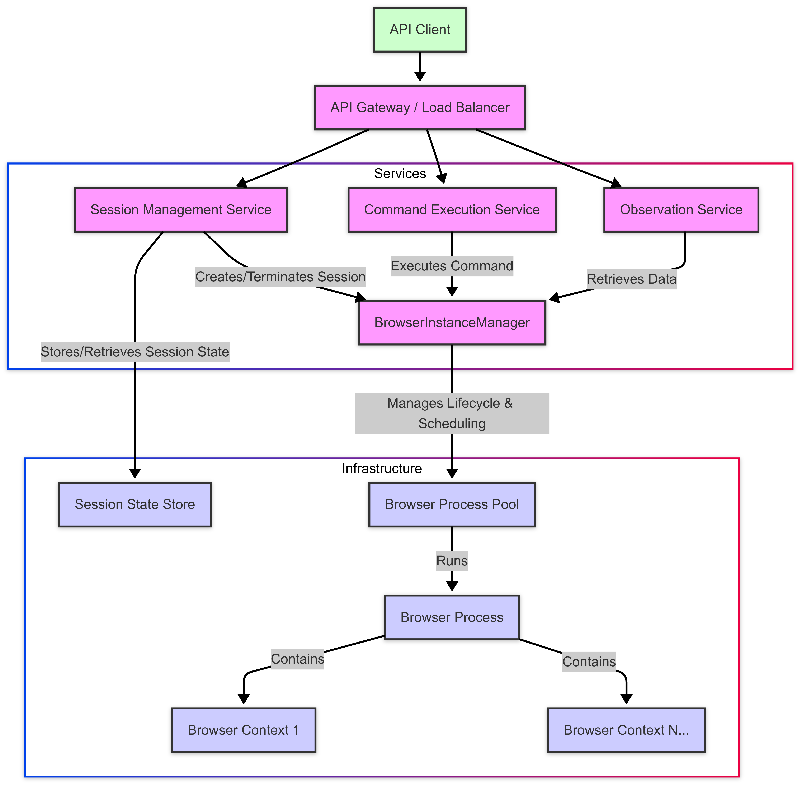

# Remote Browser Automation Service

## Overview

This service provides a way to programmatically control and observe web browsers remotely. It allows users to run automated browser tasks through an API, managing resources efficiently and reliably. Detailed design doc can be found [here](https://docs.google.com/document/d/1IuwYsZZ2NTi8_YQWQoJNC1JqbU3euJFrvH9AXl0jCaM/edit?usp=sharing)

## Architectures

Two main architectural approaches are outlined:

### 1. MVP (Simplified) Architecture

* **Goal:** Focus on core browser control features, reduce initial complexity[cite: 1, 2].
* **Design:** A single `AutomationService` handles API requests, session management, scheduling, and command/observation execution[cite: 3, 5]. It manages a pool of browser processes, each potentially running multiple browser contexts[cite: 9, 14]. Session information is tracked, potentially using an external store like Redis for better durability[cite: 12, 13].
* **Trade-offs:**
    * **Pros:** Faster initial development, simpler deployment[cite: 15].
    * **Cons:** Scales as a single unit, less resilient (a single failure can crash the service), limited technology flexibility, potential session loss on restart if using in-memory storage[cite: 16, 17, 18, 19, 20].

### 2. Microservices Architecture (Full Design)

* **Goal:** Improve scalability, resilience, and flexibility by breaking down the system into specialized services[cite: 22].
* **Design:** Introduces multiple isolated **Browser Contexts** within each Browser Process, managed by a dedicated **Browser Instance Manager (BIM)**[cite: 23, 24].
* **Key Components:**
    * **API Gateway:** Entry point, routing, load balancing[cite: 25].
    * **Session Management Service:** Manages session lifecycle (create, terminate, track state), requests/releases Browser Contexts from the BIM[cite: 27, 28, 29, 30].
    * **Session State Store:** Fast storage (e.g., Redis) for session details (context mapping, status)[cite: 31, 32].
    * **Command Execution Service:** Handles browser commands, forwards them to the correct context via the BIM[cite: 33, 34, 35, 36].
    * **Observation Service:** Handles requests to retrieve data from browser contexts via the BIM[cite: 37, 38, 39].
    * **Browser Instance Manager (BIM):** Central orchestrator. Manages browser processes and contexts, handles scheduling, resource optimization (hibernation), reliability, and routes commands/observations[cite: 40, 41, 42, 43, 44, 45, 46].
    * **Browser Process Pool (Workers):** The actual VMs/containers running browser processes, each hosting multiple contexts[cite: 48, 49].

## Core Concepts

### Browser Contexts

* Instead of one session per browser process, each process can host multiple isolated **Browser Contexts**[cite: 23].
* This significantly improves resource efficiency (less overhead per session) and potentially reduces activation latency[cite: 52, 53, 86].

### Reliability & Failure Recovery

* **Detection:** Uses health checks, agent monitoring, and timeouts[cite: 58].
* **Context-Level Recovery:** Attempts to recover individual context failures (e.g., page crash) often by restarting the context and potentially restoring state[cite: 58].
* **Process-Level Recovery:** Handles crashes of the entire browser process. The BIM detects this, marks associated contexts as failed, informs Session Management, and potentially starts a new process[cite: 58]. Sessions might be restarted or terminated based on policy.
* **General Practices:** Redundancy, idempotent operations, state persistence[cite: 59].

### Scheduling & Resource Management (via BIM)

* **Goal:** Efficiently allocate browser contexts to browser processes[cite: 64].
* **State Tracking:** The BIM knows about workers, running processes (and their context count), and potentially a "warm pool" of idle processes[cite: 60, 61, 62].
* **Context Assignment:**
    1.  Find healthy processes with capacity (`active_context_count < MAX_CONTEXTS_PER_PROCESS`)[cite: 65, 66].
    2.  Apply placement policy (e.g., load balancing - least busy first, or bin packing - most busy first)[cite: 67, 68].
    3.  Assign context to the selected process[cite: 69, 70].
    4.  If no suitable process exists, start a new one (potentially from a warm pool) and assign the context there[cite: 71, 72, 73, 75].
* **Process Termination:** Idle processes (no active or hibernated contexts) are terminated after a timeout to save resources[cite: 79, 80].
* **Hibernation/Reactivation:** Idle contexts can have their state saved, and the context closed. Reactivation involves finding/starting a process and restoring the state[cite: 44, 81, 82].

### Key Tunables

* `MAX_CONTEXTS_PER_PROCESS`: Controls density[cite: 83].
* `PROCESS_IDLE_TIMEOUT`: How long a process stays alive with no contexts[cite: 83].
* `WARM_POOL_SIZE`: Number of ready-to-use idle processes[cite: 84].
* Placement Policy: Load Balancing vs. Bin Packing[cite: 84].

## Technology Considerations (Examples)

* **Automation Libraries:** Playwright/Puppeteer (support browser contexts)[cite: 85].
* **State Persistence:** Redis or S3 for hibernated context state[cite: 86].
* **Orchestration:** Kubernetes or similar for managing worker processes[cite: 76, 80].
* **Services:** Built using common web frameworks (language/framework depends on team preference).